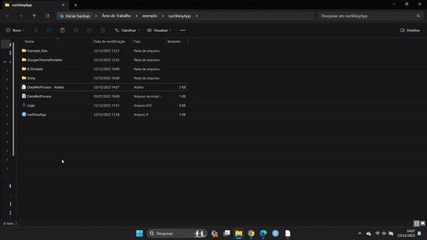

DataMetProcess_Shiny_Portable-gitpage
================
Wagner Martins dos Santos

# DataMetProcess Shiny Portable 

-The portable version of the application ensures its performance even in the face of changes to dependency packages, while simplifying its distribution.

-To access the portable app, follow the link: https://1drv.ms/u/s!AiGscn2-DwUAjbQbIBlh5jLeGDlWEg?e=1eW8YV

-To launch the application, execute the shortcut located in the root folder.

